# TheWatsonCrew

[![Contributors][contributors-shield]][contributors-url]
[![Forks][forks-shield]][forks-url]
[![Stargazers][stars-shield]][stars-url]
[![Issues][issues-shield]][issues-url]
[![MIT License][license-shield]][license-url]

<br />
<div align="center">
<a href="https://github.com/Sar2580P/TheWatsonCrew">
   
</a>
<h2 align="center">The Watson Crew</h2>

  <p align="center">
   AI-driven app with smart navigation, interactive chatbot, insightful videos, and personalized assessments.
    <br />
    <br />
    <a href="https://github.com/Sar2580P/TheWatsonCrew/issues">Report Bug</a>
    ·
    <a href="https://github.com/Sar2580P/TheWatsonCrew/issues">Request Feature</a>
  </p>
</div>

## About The Project

The Learning App is designed to provide a personalized educational experience. Users can input links to resources they want to learn from, and the LLM will update its knowledge base accordingly. The app offers various features, including reading generated pages, learning through video lectures, taking tests, and chatting with the AI.

<p align="right">(<a href="#readme-top">back to top</a>)</p>

### Built With

- [![react][react]][react-url]
- [![next][next]][next-url]
- [![typescript][typescript]][typescript-url]
- [![django][django]][django-url]
- [![VisualStudioCode][VisualStudioCode]][VisualStudioCode-url]

<p align="right">(<a href="#readme-top">back to top</a>)</p>

## Getting Started

So as to run our project locally, you need to follow the steps below.

### Installation

1. Clone the repository:

   ```sh
   https://github.com/Sar2580P/TheWatsonCrew.git
   cd TheWatsonCrew
   ```

2. Install dependencies for the frontend (Next.js):

   ```sh
   make setup
   make setupweb
   ```

3. Install dependencies for the frontend (Next.js):

   ```sh
   cd web
   npm install
   ```

4. Install dependencies for the backend (Django):

   ```sh
   cd ../api
   python3 -m venv .venv
   source .venv/bin/activate
   pip install -r requirements.txt
   ```

5. Run the development servers:

   - For Next.js (frontend):

   ```sh
   cd web
   npm run build
   npm start
   ```

   - For Django (backend):

   ```sh
   cd ../api
   python manage.py runserver
   ```

6. Open your browser and navigate to `http://localhost:3000` for the frontend and `http://127.0.0.1:8000/api` for the backend admin interface.

<p align="right">(<a href="#readme-top">back to top</a>)</p>

<!-- USAGE EXAMPLES -->

## Description

The Learning App is designed to provide a personalized educational experience. Users can input links to resources they want to learn from, and the LLM will update its knowledge base accordingly. The app offers various features, including reading generated pages, learning through video lectures, taking tests, and chatting with the AI.

</br>

## Problem

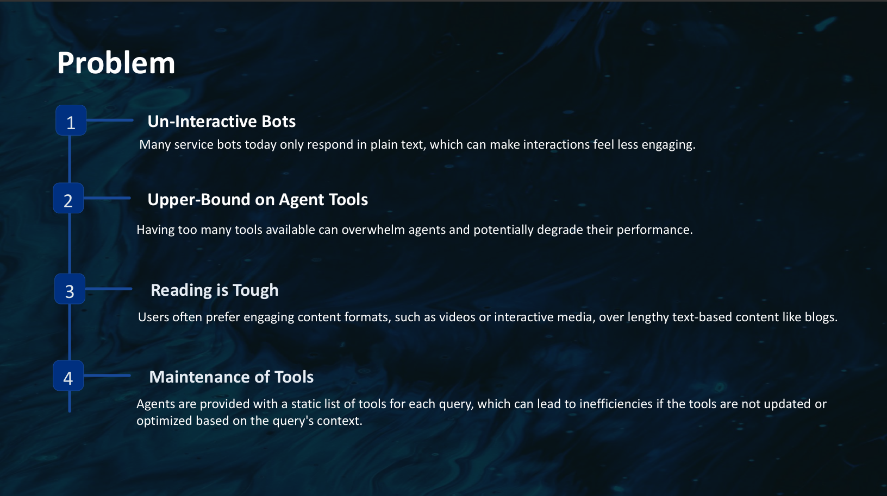

## Solution

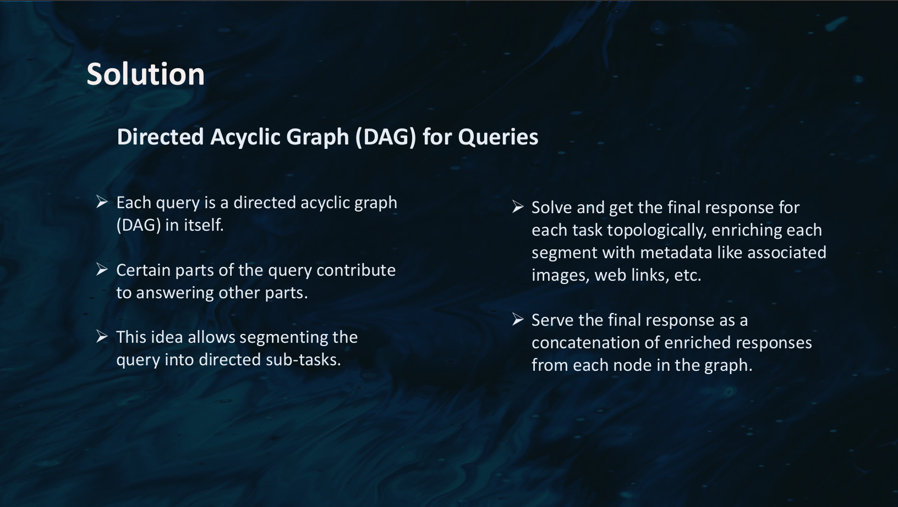

## Approach

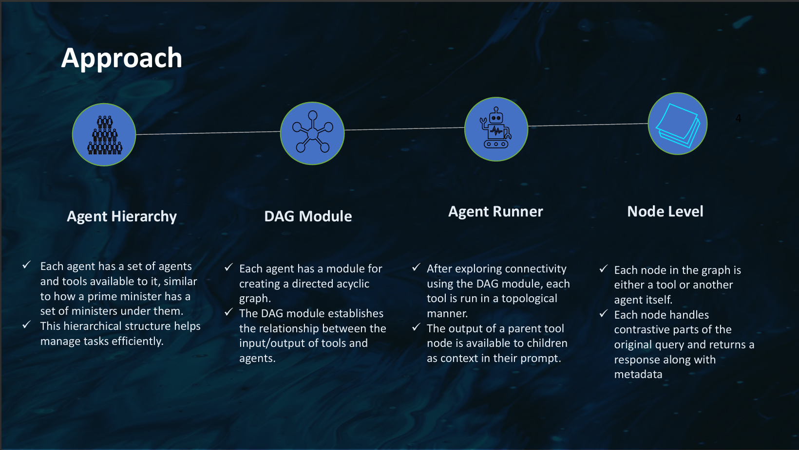

## App Features

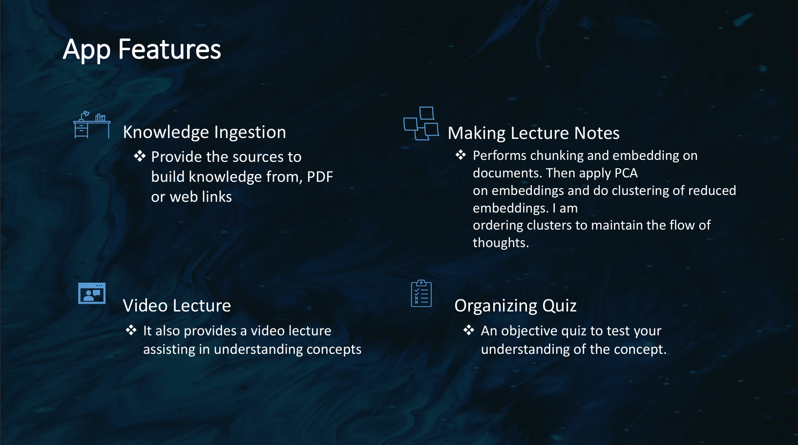

## Technologies Used

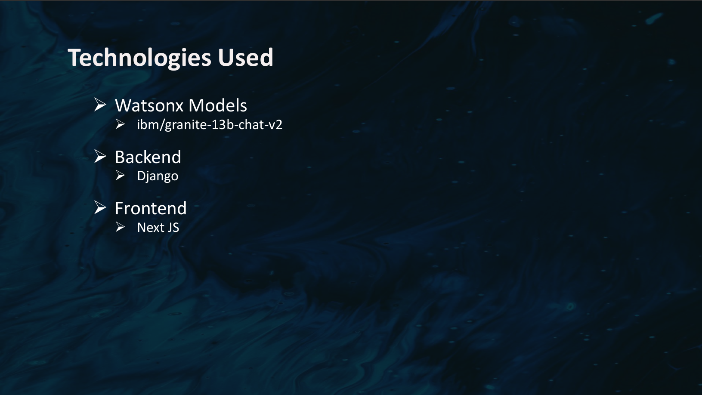

## Pages Overview

### Home Page

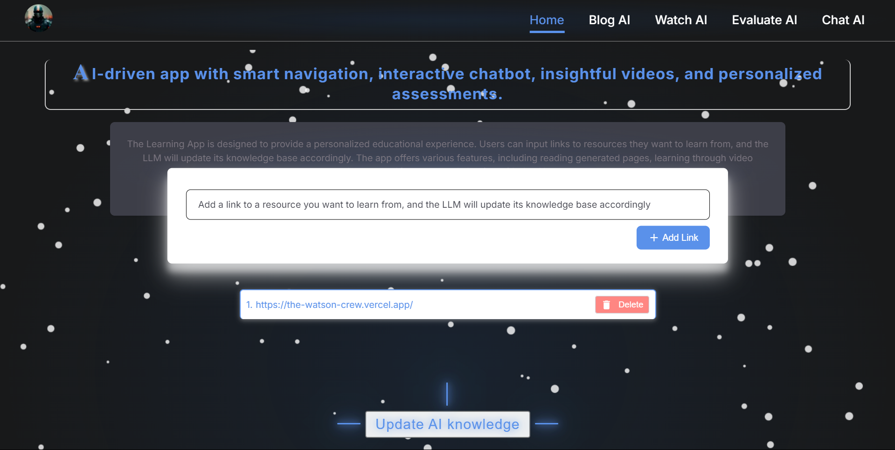

### Blog AI

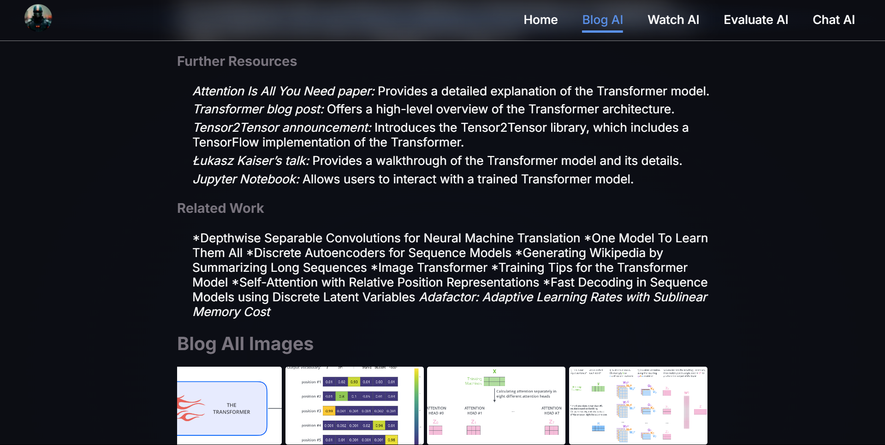

### Watch AI

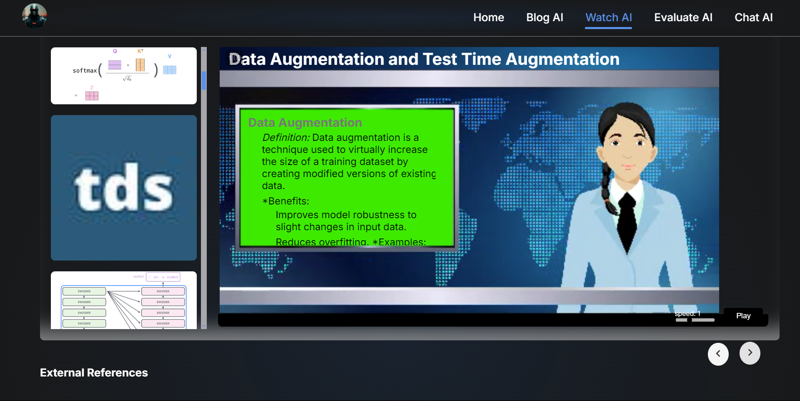

### Evaluate AI

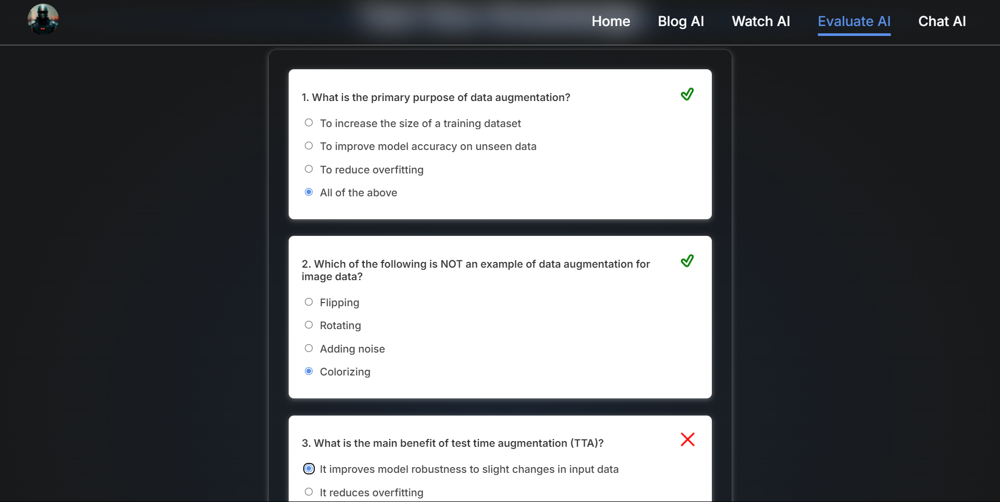

### Chat AI

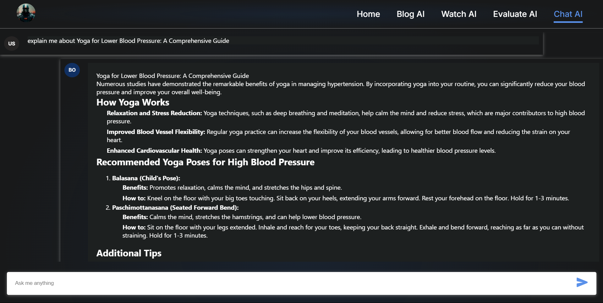
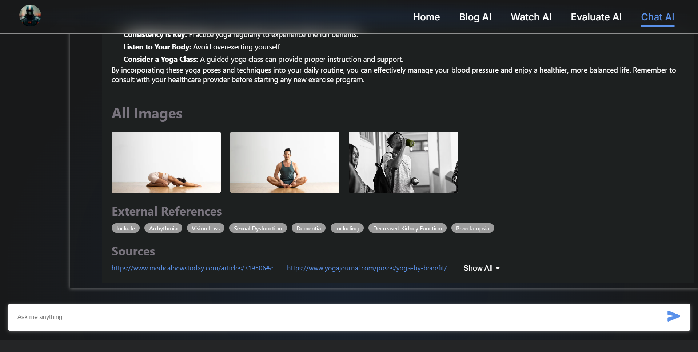

<p align="right">(<a href="#readme-top">back to top</a>)</p>

<!-- CONTRIBUTING -->

## Contributing

Contributions are what make the open source community such an amazing place to learn, inspire, and create. Any contributions you make are greatly appreciated.

If you have a suggestion that would make this better, please fork the repo and create a pull request. You can also simply open an issue with the tag "enhancement".
Don't forget to give the project a star! Thanks again!

1. Fork the Project
2. Create your Feature Branch (`git checkout -b feature/AmazingFeature`)
3. Commit your Changes (`git commit -m 'Add some AmazingFeature'`)
4. Push to the Branch (`git push origin feature/AmazingFeature`)
5. Open a Pull Request

<p align="right">(<a href="#readme-top">back to top</a>)</p>

<!-- CONTACT -->

## Acknowledgments

Use this space to list resources you find helpful and would like to give credit to. I've included a few of my favorites to kick things off!

- [GitHub Pages](https://pages.github.com)
- [Font Awesome](https://fontawesome.com)

A special thank you to all the current contributors who have made this project possible. You can view the contributors

- [Sar2580P](https://github.com/Sar2580P).
- [Shivam kumar](https://github.com/shivam6862)

<p align="right">(<a href="#readme-top">back to top</a>)</p>

[contributors-shield]: https://img.shields.io/github/contributors/Sar2580P/TheWatsonCrew.svg?style=for-the-badge
[contributors-url]: https://github.com/Sar2580P/TheWatsonCrew/graphs/contributors
[forks-shield]: https://img.shields.io/github/forks/Sar2580P/TheWatsonCrew.svg?style=for-the-badge
[forks-url]: https://github.com/Sar2580P/TheWatsonCrew/network/members
[stars-shield]: https://img.shields.io/github/stars/Sar2580P/TheWatsonCrew.svg?style=for-the-badge
[stars-url]: https://github.com/Sar2580P/TheWatsonCrew/stargazers
[issues-shield]: https://img.shields.io/github/issues/Sar2580P/TheWatsonCrew.svg?style=for-the-badge
[issues-url]: https://github.com/Sar2580P/TheWatsonCrew/issues
[license-shield]: https://img.shields.io/github/license/Sar2580P/TheWatsonCrew.svg?style=for-the-badge
[license-url]: https://github.com/Sar2580P/TheWatsonCrew/blob/master/LICENSE.txt
[linkedin-shield]: https://img.shields.io/badge/-LinkedIn-black.svg?style=for-the-badge&logo=linkedin&colorB=555
[linkedin-url]: https://linkedin.com/
[react]: https://img.shields.io/badge/React-20232A?style=for-the-badge&logo=react&logoColor=61DAFB
[react-url]: https://react.dev/
[VisualStudioCode]: https://img.shields.io/badge/Made%20for-VSCode-1f425f.svg
[VisualStudioCode-url]: https://code.visualstudio.com/
[nodejs-url]: https://nodejs.org/en
[nodejs]: https://img.shields.io/badge/Node.js-43853D?style=for-the-badge&logo=node.js&logoColor=white
[mongodb-url]: https://www.mongodb.com/
[mongodb]: https://img.shields.io/badge/MongoDB-4EA94B?style=for-the-badge&logo=mongodb&logoColor=white
[next-url]: https://nextjs.org/docs
[next]: https://img.shields.io/badge/next.js-000000?style=for-the-badge&logo=nextdotjs&logoColor=white
[reduxjs-url]: https://redux.js.org/
[reduxjs]: https://img.shields.io/badge/Redux-593D88?style=for-the-badge&logo=redux&logoColor=white
[typescript-url]: https://www.typescriptlang.org/docs/handbook/typescript-in-5-minutes.html
[typescript]: https://img.shields.io/badge/TypeScript-007ACC?style=for-the-badge&logo=typescript&logoColor=white
[django]: https://img.shields.io/badge/Django-092E20?style=for-the-badge&logo=django&logoColor=white
[django-url]: https://docs.djangoproject.com/en/5.0/
